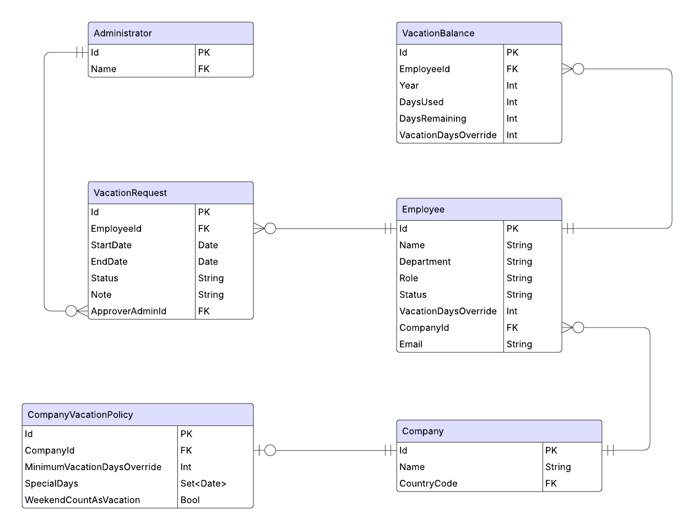

# Avonova Vacation Registration

## Task Summary

Build a backend and frontend system to manage vacation requests.

The frontend uses Vue.js 3 and mimics the vacation request modal shown in the provided screenshots. It should validate input as thoroughly as possible before submitting requests to the backend.

The backend is written in C# and exposes a REST API to:

- Retrieve vacation balances
- Register vacation requests
- Approve or reject vacation requests
- Retrieve public holidays for a given company

The system must support localization and comply with country-specific policies and regulations.

## My Approach

I began by reviewing the email, Confluence documentation, and screenshots to form a mental picture of the system.

The Confluence spec and screenshots gave me nearly everything I needed to sketch an initial diagram of possible entities and relationships. Some assumptions had to be made.



Initially, the design included more entities, like *countries* and *country vacation policies*.

### Backend

To get started, I created models for all entities and exposed REST controllers for each one. This made it easy to create and fetch data for admins, employees, companies, etc. Later most of these were removed to not clutter the project.

One of the more important tasks was figuring out how to handle the country-specific vacation policy logic. This is a core challenge since the system should support multiple countries.

At first, I considered building a single service to evaluate vacation rules based on the country, but that approach didn't scale well. As more countries are added, maintaining a single rules engine would become messy and difficult to extend.

Instead, I went with an interface-based approach: each supported country gets its own implementation of a `IVacationPolicy` interface. The interface defines two key methods:

- Get the number of vacation days for an employee
- Get public vacation days for the company

For example:
- Norway gives 25 vacation days, which can be overridden by company policy or per employee. People over 60 get 5 extra days (not implemented, but the code supports it).
- The USA has no official public holidays in the system, but companies often define their own (not implemented yet, but could be added to a "Company Vacation Policy").

Countries currently supported as examples: Norway, Sweden, and the USA.

### Frontend

Since I have limited experience with modern frontend frameworks like Vue.js, I relied on GitHub Copilot and ChatGPT to help generate boilerplate and connect it to the backend.

### Localization

Both backend and frontend support localization:

- **Backend:** Uses C# middleware for localization based on query parameters, cookies, or the `Accept-Language` HTTP header. Translation files for English, Swedish, and Norwegian are included and used for error messages returned by the API.
  
- **Frontend:** Uses Vue.js' i18n library to store the selected language locally. The UI didn't originally include this, but I added a country selector to make testing easier.

### Scalability
To add the system to a new country requires generally two things:
1. Define a country specific vacation policy, implementing `IVacationPolicy`.
   1. Generally if all necessary information is available from `CompanyVacationPolicy` and  `Employee`, there should be no need to refactor other parts of the system. An example of where this would be necessary is for the Norwegian policy that need access to the employee's age.
2. Adding translations, if applicable, to backend and frontend.

## Assumptions & Simplifications

- Vacation can only be registered for the current calendar year.
- Vacation can't span across different years.
- Vacation policy is based on the company's country, **not** where the employee lives.

## TODO

- **Tests**  
  I haven't taken the time to implement automated tests yet.

- **Manage public holidays dynamically**  
  Currently, these are hardcoded. Ideally, a library like `Nager.Date` would be used, but it requires a license.

- **Use DTOs for API responses**  
  At the moment, most endpoints return internal models, which can cause issues like circular references and leaking unnecessary data.

- **Better API error handling**  
  The frontend shows generic errors even though the backend returns localized error messages.  
  I'd likely adopt the `application/problem+json` format (RFC 7807) for consistency and clarity.

- **Authentication**  
  Admin users should log in and only access data for their own company.

- **Restrict admin view**  
  Admins should only see employees that belong to their company.


## How To Run
```
cd VacationManagementApi/ClientApp
npm run build

cd ..
dotnet run
```

Open `http://localhost:5014/app/` in your browser.

